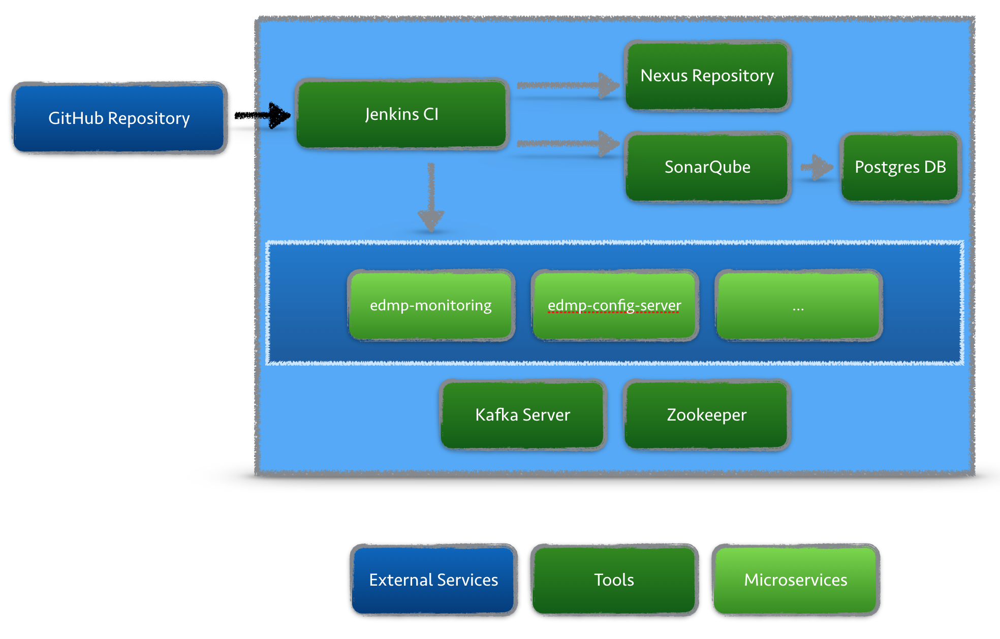

## Overview



More information to come ... stay tuned.

## Related Projects

- https://github.com/codecentric/edmp-monitoring
- https://github.com/codecentric/edmp-config-server
- https://github.com/codecentric/event-based-shopping-system
- ...

## Prerequisites (Mac)

You should have Docker Toolbox installed, see https://www.docker.com/toolbox

I am using docker-compose to start several docker container at once.
Since all containers run in a single VM (virtualbox), this VM needs enough memory.

### Step 0 - Check Docker Machine version

Ensure that you are using version 0.3.0 or greater of `docker-machine`

```
$ docker-machine version
docker-machine version 0.6.0, build e27fb87
```

### Step 1 - Start Docker Machine

Start the machine, using the `--virtualbox-memory` option to increase it’s memory. I also recommend using the `--virtualbox-disk-size` option to increate it's disk size. I use 6000 MB to accommodate all the docker images and 40000 MB to allow for enough disk space.

```
$ docker-machine create -d virtualbox --virtualbox-memory "6000" --virtualbox-disk-size "40000" default
Running pre-create checks...
Creating machine...
(default) Creating VirtualBox VM...
(default) Creating SSH key...
(default) Starting VM...
Waiting for machine to be running, this may take a few minutes...
Machine is running, waiting for SSH to be available...
Detecting operating system of created instance...
Detecting the provisioner...
Provisioning with boot2docker...
Copying certs to the local machine directory...
Copying certs to the remote machine...
Setting Docker configuration on the remote daemon...
Checking connection to Docker...
Docker is up and running!
To see how to connect Docker to this machine, run: docker-machine env default
```

### Step 2 - Set Docker Machine Connection

Configure shell environment to connect to your new Docker instance

```
$ eval "$(docker-machine env default)"
```

## Getting started

To get all docker containers up and running use:

```
$ git clone git@github.com:codecentric/event-driven-microservices-platform.git
$ cd event-driven-microservices-platform
$ docker-compose up
```

## Tools

| *Tool* | *Link* | *Credentials* |
| ------------- | ------------- | ------------- |
| Jenkins | http://${docker-machine ip default}:18080/ | no login required |
| SonarQube | http://${docker-machine ip default}:9000/ | admin/admin |
| Nexus | http://${docker-machine ip default}:18081/nexus | admin/admin123 |
| Docker Registry | http://${docker-machine ip default}:5000/ | |

## FAQ

### Having problems downloading docker images?

**Error:** Network timed out while trying to connect to https://index.docker.io/

**Solution**

```
# Add nameserver to DNS
echo "nameserver 8.8.8.8" > /etc/resolv.conf

# Restart the environment
$ docker-machine restart default

# Refresh your environment settings
$ eval $(docker-machine env default)
```

### No Internet Connection from Docker Container

```
# Login to Docker VM
$ docker-machine ssh default

# Run DHCP client
$ sudo udhcpc

# Restart docker process
$ sudo /etc/init.d/docker restart
```
